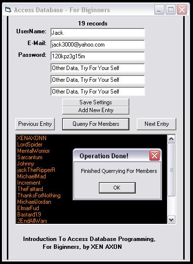



## Access Database For Beginners

### Description

This is a good example of access database, for beginners, add, edit, add UserNames to list box and browse trough it. Very simple to understand.
 
### More Info
 
- You Have To Vote For It If You Find It Usefull :D.

             |
---                |---
**Submitted On**   |2006-05-12 19:30:02
**By**             |[XEN AXON](https://github.com/Planet-Source-Code/PSCIndex/blob/master/ByAuthor/xen-axon.md)
**Level**          |Beginner
**User Rating**    |4.8 (19 globes from 4 users)
**Compatibility**  |VB 6\.0
**Category**       |[Databases/ Data Access/ DAO/ ADO](https://github.com/Planet-Source-Code/PSCIndex/blob/master/ByCategory/databases-data-access-dao-ado__1-6.md)
**World**          |[Visual Basic](https://github.com/Planet-Source-Code/PSCIndex/blob/master/ByWorld/visual-basic.md)
**Archive File**   |[Access\_Dat1993615122006\.zip](https://github.com/Planet-Source-Code/xen-axon-access-database-for-beginners__1-65309/archive/master.zip)

